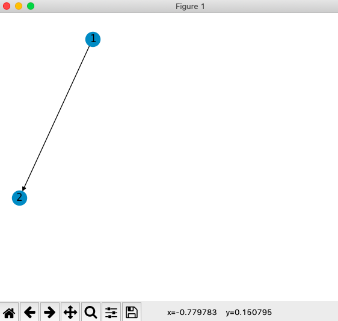

# Piniverse

[](https://badge.fury.io/py/piniverse)
[](https://travis-ci.org/hzhao19/piniverse)
[](https://codecov.io/gh/hzhao19/piniverse)
[](https://opensource.org/licenses/MIT)
[](https://github.com/dwyl/esta/issues)

Piniverse is a lightweight Python library to programmatically orchestrate functions. 

<br>
  <p align="center">
    
  </p>
<br>

Table of contents
---------------

- [Features Support](#features-support)
- [Prerequisites](#prerequisites)
- [Getting Started](#getting-started)
- [Limitations](#limitations)
- [Contributions](#contributions)

Features Support 
---------------

- [X] Visualization of directed acyclic graph
- [X] Topological sorting and execution of pinned functions

Prerequisites 
---------------

* Python 3.7

Getting Started
---------------

### Installation

```
$ pip install piniverse
```

### Basic Usage

Piniverse inspects pinned functions inside your package.

```
.
├── workspace/   <-- workspace package
├── main.py      <-- main.py

```

Pin any function you wish to orchestrate as a DAG! Every pinned function is provided with 2 identifiers: task and toward.

```
# workspace/

from piniverse import Pinned


@Pinned(
  task='1',
  toward='2', 
  arguments={
    args: ['Task 1']
    kwargs: {'content': 'I output first!'}
  }
)
def foo(name: str, content: str = '', **kwargs) -> None:  
  print('Hi, I am {}... {}'.format(name, content))


@Pinned(
  task='2',
  arguments={
    args: ['Task 2']
    kwargs: {'content': 'I output second!'
  }
)
def another_foo(title: str, content: str = '', **kwargs) -> None:
  print(Hi, I am {}... {}'.format(name, content))
```

To execute your DAG, simply plan and apply!

```
# main.py

import piniverse
import workspace


piniverse.plan(workspace)
piniverse.apply()
```

And, your tasks should be executed in topological ordering

```
[~] Hi, I am Task 1... I output first!
[~] Hi, I am Task 2... I output second!
```

Note that every pinned function require kwargs arguments. For more details, please read below.

### Advanced Usage

Upstream tasks can share content down through a store. Similarly, downstream tasks can read upstream content from the shared store. Return values from upstream values are, by default, always shareable.

```
# workspace/

from piniverse import Pinned


@Pinned(task='1', toward='2')
def foo(**kwargs) -> None:  
  kwargs['store'].push(key='shared', content='from foo')
  return 'foo returns'


@Pinned(task='2')
def another_foo(**kwargs) -> None:
  print(kwargs['store'].pull(key='shared'))
  print(kwargs['store'].rpull(task='foo_task'))
```

```
# main.py

import piniverse
import workspace


piniverse.plan(workspace)
piniverse.apply()
```

```
[~] from foo
[~] foo returns
```

Importantly, tasks can only communicate with those belonging to the same stream. 

```
# workspace/

from piniverse import Pinned


@Pinned(task='1', toward='2')
def foo(**kwargs) -> None:  
  kwargs['store'].push(key='shared', content='from foo')
  return 'foo returns'


@Pinned(task='2')
def another_foo(**kwargs) -> None:
  print(kwargs['store'].pull(key='shared'))
  print(kwargs['store'].rpull(task='foo_task'))
  
 
@Pinned(task='3')
def yet_another_foo(**kwargs) -> None:
  print(kwargs['store'].pull(key='shared'))  <-- This would raise an exception!
```

### User Interface

Piniverse also provides a straightforward DAG visualization option. 

```
# main.py

pinverse.plan(workspace, plan_view=True)
```

<br>
  <p align="center">
    
  </p>
<br>

Limitations 
---------------

Presently, Piniverse solely supports standalone functions and a one-child policy per DAG node.

Contributions 
---------------

Contributions are more than welcome! Check out the [contribution documentation](https://github.com/hzhao19/piniverse/blob/master/CONTRIBUTIONS.rst).
